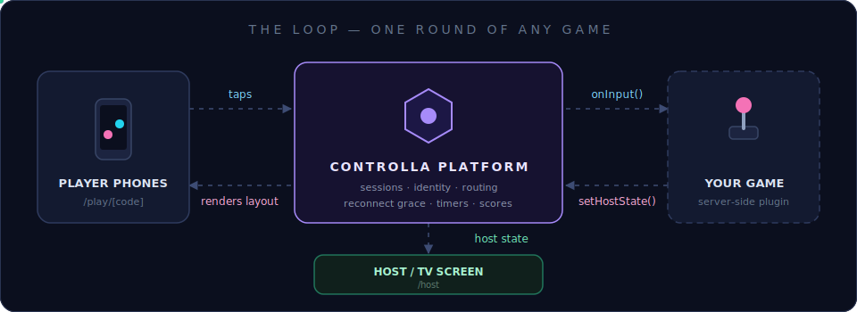

<div align="center">



<br/>


**A host screen creates a session · players scan a QR · their phones become controllers · games run as provider plugins.**

[How it works](#-how-it-works) · [Architecture](#-architecture) · [Quick start](#-quick-start) · [Bring your game](#-bring-your-game) · [Docs](#-docs)

</div>

---

## 🎮 How it works



1. **The host opens `/host`** — the platform creates a session with a join code and a QR.
2. **Players scan the QR** — `/play/[code]` turns each phone into a controller. No app install.
3. **A game plugin drives the round** — it receives inputs, pushes declarative controller layouts to phones, and broadcasts state to the big screen. Joining, identity, disconnects, and the reconnect grace window are all handled by the platform before the game hears about anything.

## ✨ What the platform owns

| | |
|---|---|
| 📱 **Declarative controllers** | Games emit JSON layouts (`buttons`, `dpad`, `text-input`, `choice-list`, `slider`…); the platform renders them on phones and routes taps back. Games never write controller UI code. |
| 🔌 **Plugin runtime** | Server-authoritative, sandboxed contract: games get `ctx` (timers, scores, seeded RNG, storage) and never touch sockets, databases, or phones directly. |
| 🔁 **Reconnection grace** | Phones drop and come back; layout replay is automatic. Games only see *real* departures. |
| 🏆 **Scores & results** | Session leaderboard accumulates across games; results are stored durably and survive host refreshes. |
| 🗄️ **State done right** | Redis for live session state, MongoDB for durability — every query indexed. |
| 🚫 **Zero games shipped** | The platform is the console, not the games. Providers bring games as installable packages. |

## 🏗 Architecture



```
platform/backend/    Node.js (TypeScript) — Express 5 + Socket.IO, MongoDB + Redis,
                     server-authoritative game runtime, plugin loader, admin API
platform/frontend/   Next.js — host screen (/host), phone controller (/play/[code]),
                     operator panel (/admin)
Game/                Example provider game (Scribble)
docs/                Platform understanding, implementation plan, game provider guide
```

## 🚀 Quick start

```bash
# backend
cd platform/backend
docker compose up -d          # Redis (6381) + Mongo (27018)
cp .env.example .env
pnpm install && pnpm dev      # http://localhost:4000

# frontend
cd ../frontend
cp .env.local.example .env.local
pnpm install && pnpm dev      # http://localhost:3000/host
```

Smoke test:

```bash
curl http://localhost:4000/healthz
curl -X POST http://localhost:4000/sessions   # → { sessionId, code, joinUrl, hostToken }
```

See [`platform/backend/README.md`](platform/backend/README.md) for tests, invariants, and LAN/phone setup.

## 🧩 Bring your game

A game is a **server-side plugin** — plain JavaScript that matches the contract is a valid game, no dependency on us required:

```js
export function createPlugin() {
  let ctx;
  return {
    metadata: () => ({ id: 'reaction-duel', name: 'Reaction Duel', version: '1.0.0',
                       minPlayers: 2, maxPlayers: 8, tickRate: 0 }),
    async init(context, players) {
      ctx = context;
      await ctx.setAllControllerLayouts({
        layoutVersion: 1,
        components: [{ kind: 'buttons', id: 'pad', buttons: [{ id: 'go', label: 'GO!' }] }]
      });
    },
    async onInput(playerId, input) {
      if (input.controlId !== 'go') return;
      await ctx.scores.add(playerId, 1);
      await ctx.endGame({ rankings: [{ playerId, score: 1, rank: 1 }] });
    }
  };
}
```

Everything a game can do lives on `ctx`: controller layouts, host state, timers, the session leaderboard, seeded randomness, and instance storage. The full integration contract is in the [Game Provider Guide](docs/GAME_PROVIDER_GUIDE.md).

## 📚 Docs

| Doc | What's inside |
|---|---|
| [Platform Understanding](docs/PLATFORM_UNDERSTANDING.md) | The conceptual model |
| [Implementation Plan](docs/IMPLEMENTATION_PLAN.md) | Protocol and data-model decisions |
| [Game Provider Guide](docs/GAME_PROVIDER_GUIDE.md) | How providers launch games on Controlla |
| [Backend README](platform/backend/README.md) | Tests, invariants, LAN/phone setup |

---

<div align="center">

**The platform ships zero games. That's the point — bring yours.**

</div>
